# OSTR — Ecommerce Fashion Store

OSTR is an ecommerce fashion store that puts browsing, saving, and checkout in one shop. Shoppers browse men, women, and kids, open a product, add it to the cart or wishlist, and confirm a cash order. Admins add and remove products in the same catalog.

The store holds **200+ products** in one catalog. Cart, wishlist, and cash checkout stay on a single path, and catalog changes are made from the admin dashboard shoppers buy from.

---

## 🔧 Features

### 🛍️ Shopper

- Browse men, women, and kids, then open a product with related items
- Add a chosen size and color to the cart or the wishlist
- Confirm an order and pay cash from the cart
- Review past orders from the profile

### 🛠️ Admin

- Add a product with photos, price, and category
- See existing products and delete them from the same dashboard

### 🌍 Store experience

- English and Arabic, with right-to-left layout in Arabic
- Light and dark mode
- New collections page with a drop countdown and best sellers

---

## 💡 Impact

- Replaced scattered listings and a separate checkout step with one shop-to-order path
- Shoppers go from a product page to a confirmed cash payment without leaving the store
- Admins add and remove products in the catalog customers see
- **200+ products** across men, women, and kids in one catalog

---

## 📦 Tech Stack

| Layer      | Tech                             |
| ---------- | -------------------------------- |
| Frontend   | React, Vite, Tailwind CSS        |
| i18n       | react-i18next (English / Arabic) |
| Backend    | Node.js, Express                 |
| Database   | MongoDB                          |
| Auth       | JWT                              |
| Deployment | MongoDB Atlas, Render, Vercel    |

---

## 🎬 Site Demo

**[▶ Watch site walkthrough](./docs/ostr-demo.mp4)** (~1½ min)

Arabic glance on the home page, then English: home, new collections, sign in, shop, product in light and dark with related products, add to cart and wishlist, pay cash, wishlist, orders, admin dashboard.

---

## 📸 Screenshots

<table>
  <tr>
    <td width="50%" valign="top">
      <strong>Login</strong> 
      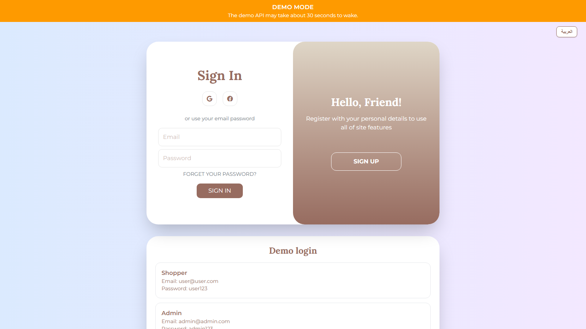
    </td>
    <td width="50%" valign="top">
      <strong>Home</strong> 
      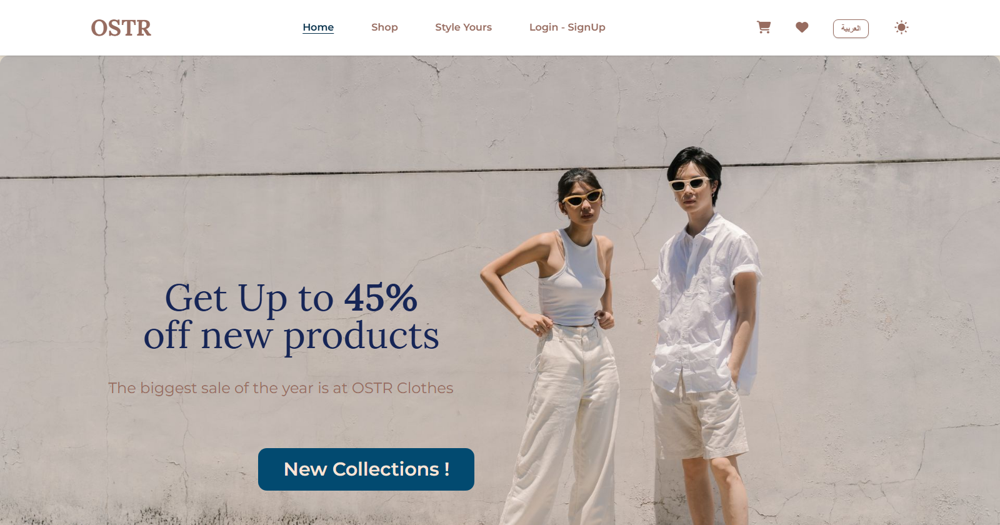
    </td>
  </tr>
  <tr>
    <td width="50%" valign="top">
      <strong>Editorial</strong> 
      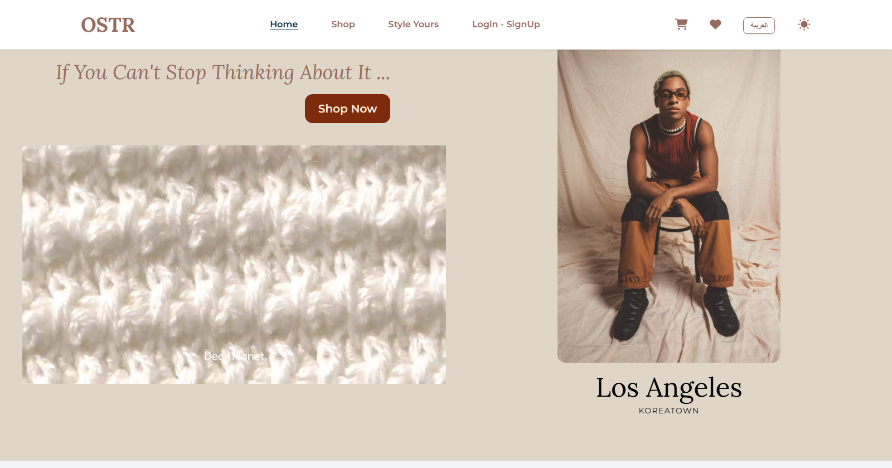
    </td>
    <td width="50%" valign="top">
      <strong>Reviews</strong> 
      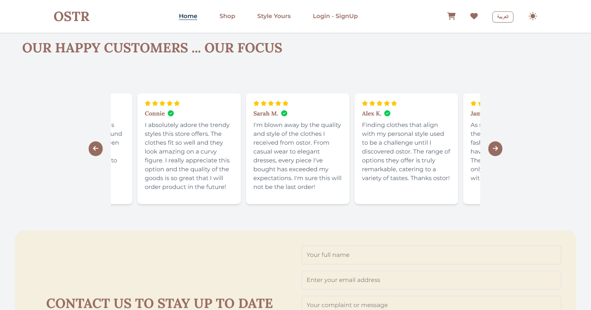
    </td>
  </tr>
  <tr>
    <td width="50%" valign="top">
      <strong>Shop</strong> 
      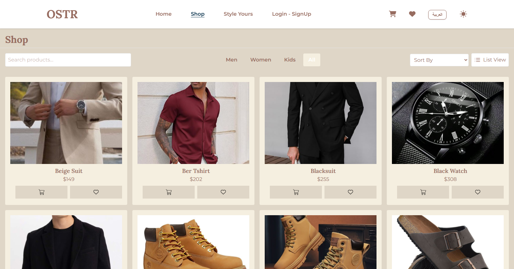
    </td>
    <td width="50%" valign="top">
      <strong>Product</strong> 
      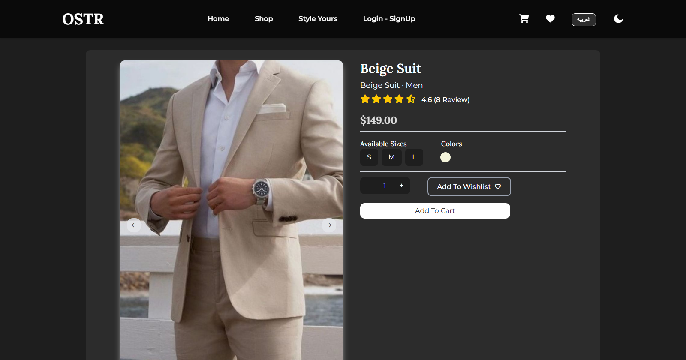
    </td>
  </tr>
  <tr>
    <td width="50%" valign="top">
      <strong>Related Products</strong> 
      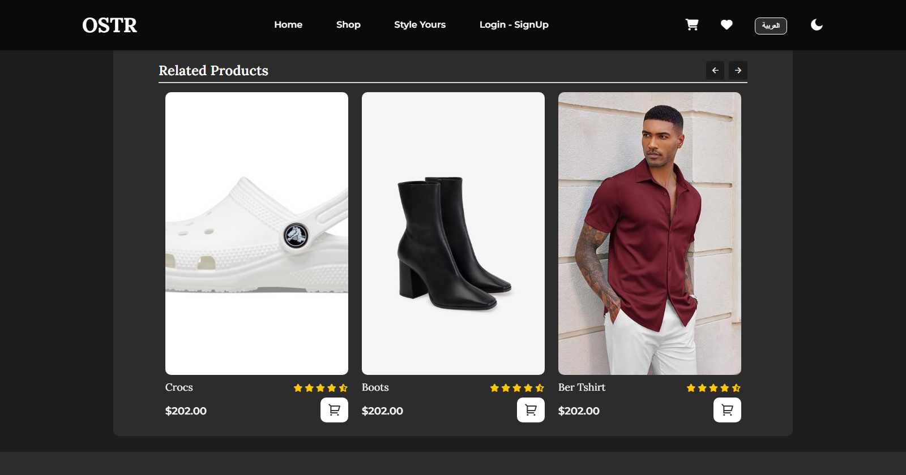
    </td>
    <td width="50%" valign="top">
      <strong>Cart</strong> 
      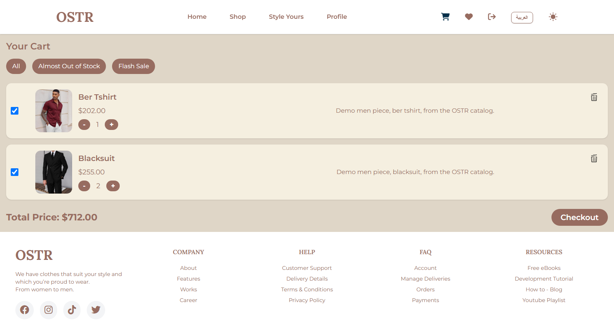
    </td>
  </tr>
  <tr>
    <td width="50%" valign="top">
      <strong>Checkout</strong> 
      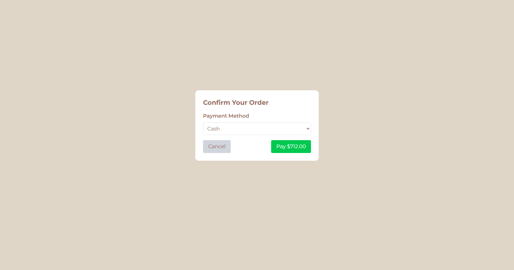
    </td>
    <td width="50%" valign="top">
      <strong>Wishlist</strong> 
      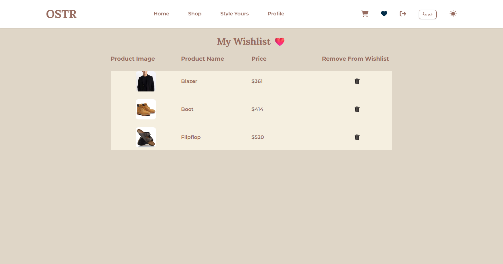
    </td>
  </tr>
  <tr>
    <td width="50%" valign="top">
      <strong>Orders</strong> 
      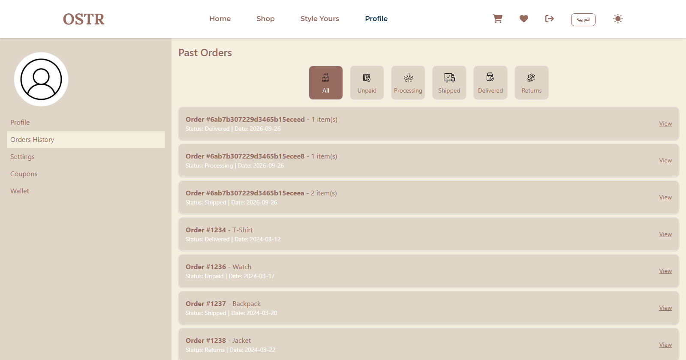
    </td>
    <td width="50%" valign="top">
      <strong>New Collection</strong> 
      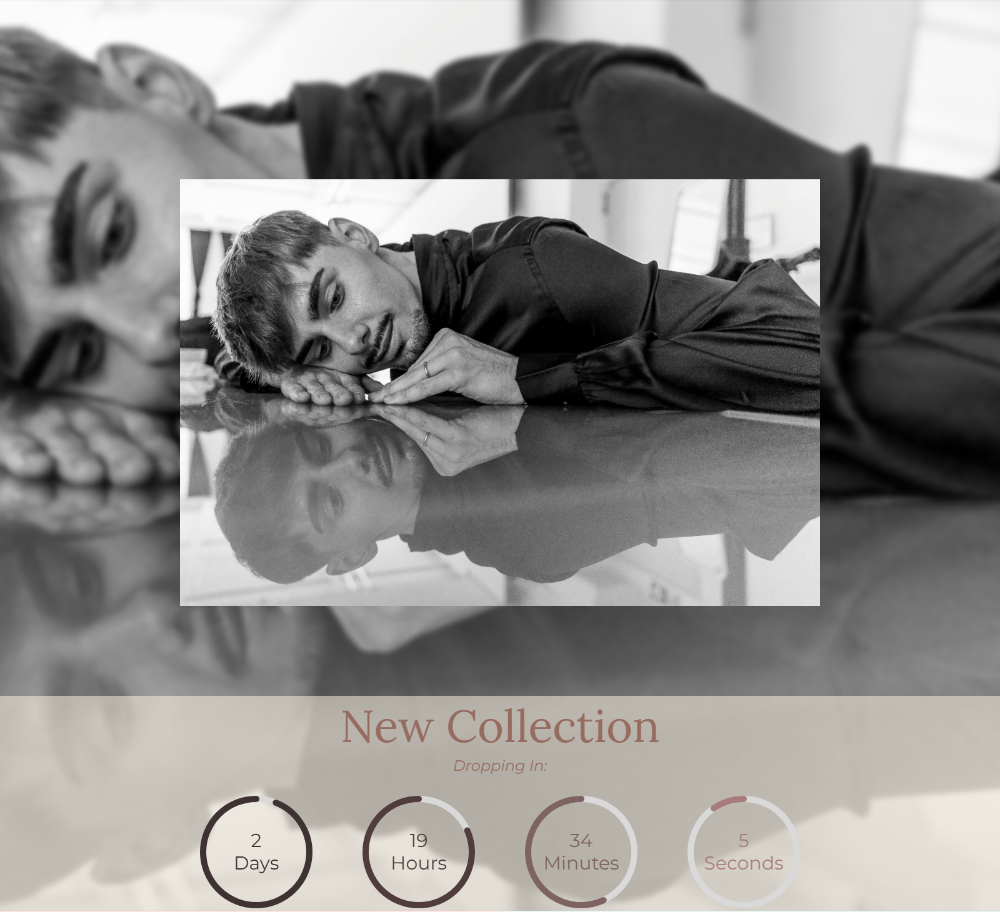
    </td>
  </tr>
  <tr>
    <td width="50%" valign="top">
      <strong>Explore</strong> 
      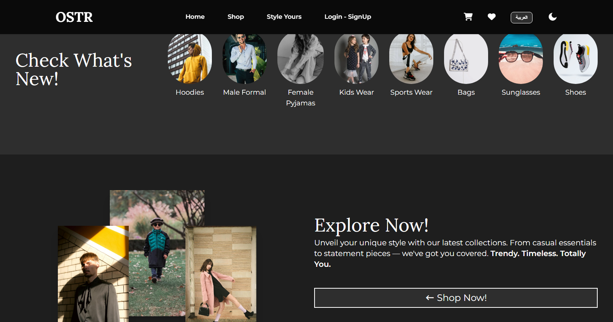
    </td>
    <td width="50%" valign="top">
      <strong>Best Sellers</strong> 
      
    </td>
  </tr>
  <tr>
    <td width="50%" valign="top">
      <strong>Admin Dashboard</strong> 
      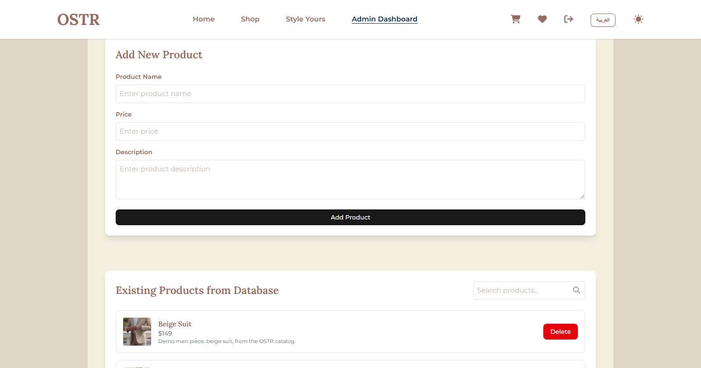
    </td>
    <td width="50%" valign="top">
      <strong>Arabic Login</strong> 
      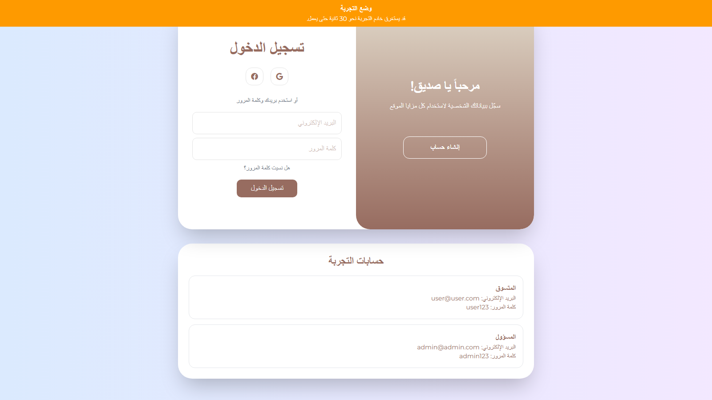
    </td>
  </tr>
</table>

---

## Live Demo 🚀

[**View Live Demo**](https://ostr-demo.vercel.app)

| Role    | Email           | Password |
| ------- | --------------- | -------- |
| Shopper | user@user.com   | user123  |
| Admin   | admin@admin.com | admin123 |

The first load after idle can take about 30 seconds while the API wakes.

---

## Authors

👤 **Omar Mahmoud**
📧 [omrmhd54@gmail.com](mailto:omrmhd54@gmail.com)
💼 [LinkedIn](https://www.linkedin.com/in/omrmhd5/)
🌐 [Portfolio](https://omarmahmoud.dev/)

👤 **Salma Mehrez**
📧 [salmamehrez85@gmail.com](mailto:salmamehrez85@gmail.com)
🔗 [GitHub](https://github.com/salmamehrez85)
